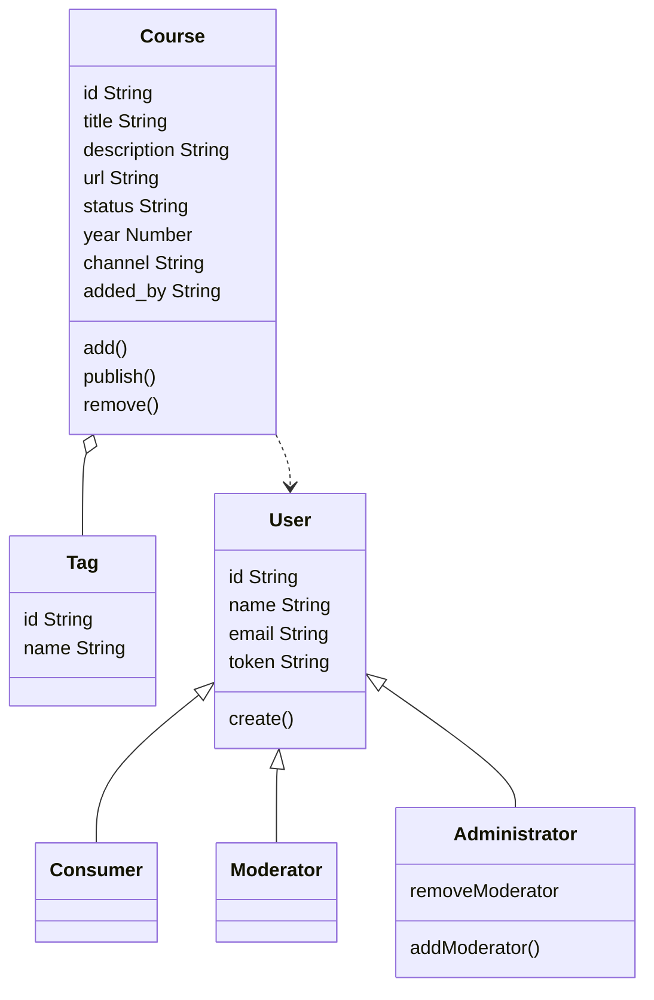
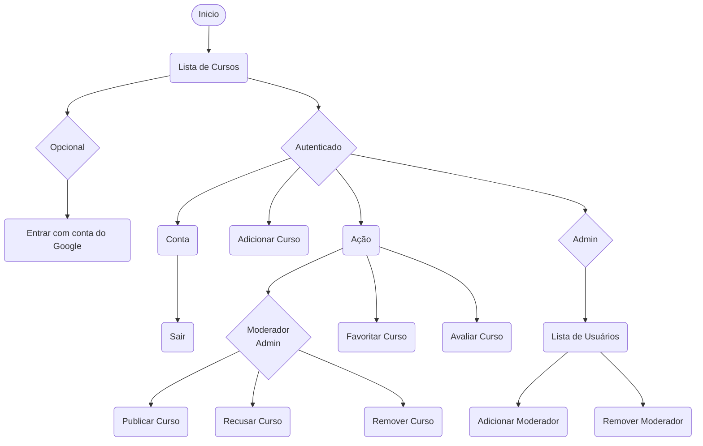
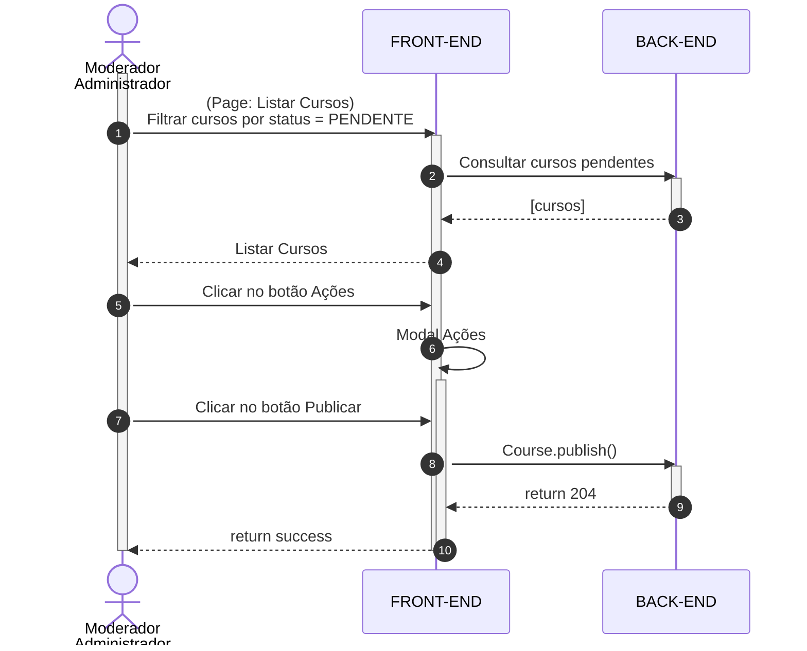
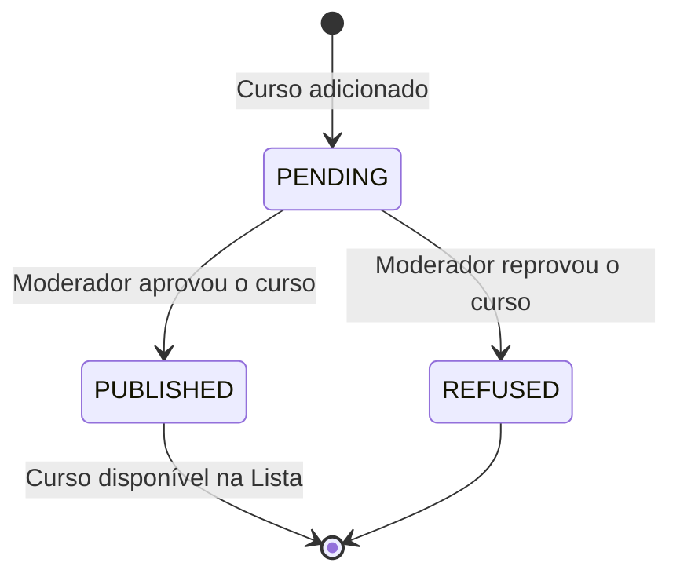

# ▶️ Prime Tube Academy

**🔧 Em desenvolvimento 🧩**
Projeto full-stack (Node, Nest, React, Next) que reúne os melhores cursos de desenvolvimento de software e tecnologia disponíveis no Youtube, facilitando a busca de forma organizada.

## 📑 Documentação UML
**⚠️ Sujeito a atualizações ⚠️**

### Casos de Uso

### Diagrama de classes

**Entidades de domínio**

### Diagrama de atividades 

**Fluxo geral da jornada do usuário**

### Diagrama de sequencia

**Publicar Video**

### Diagrama de estado

**Status do Curso**

